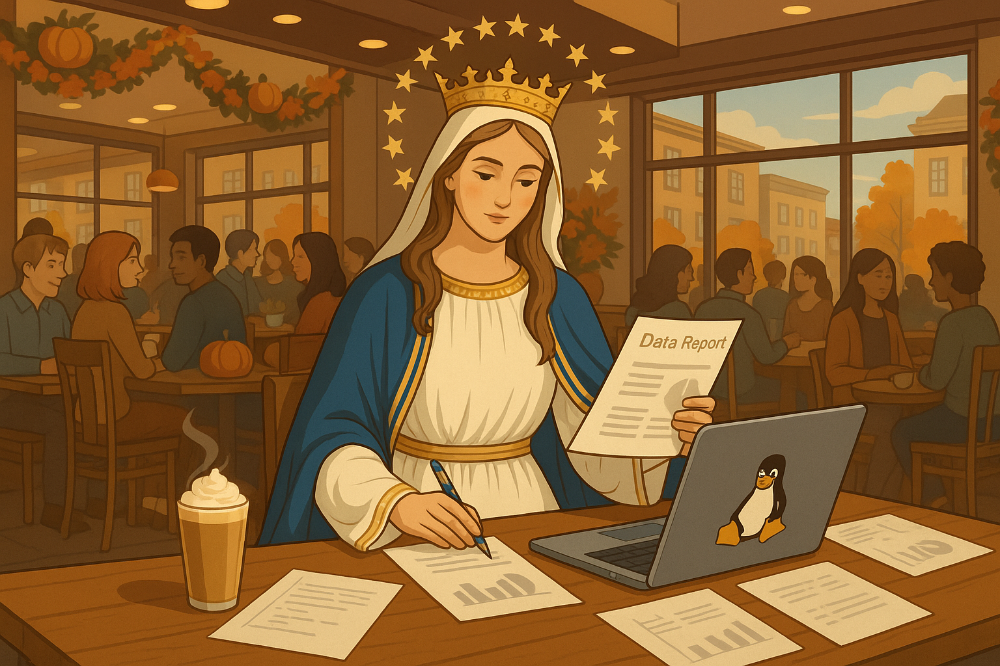
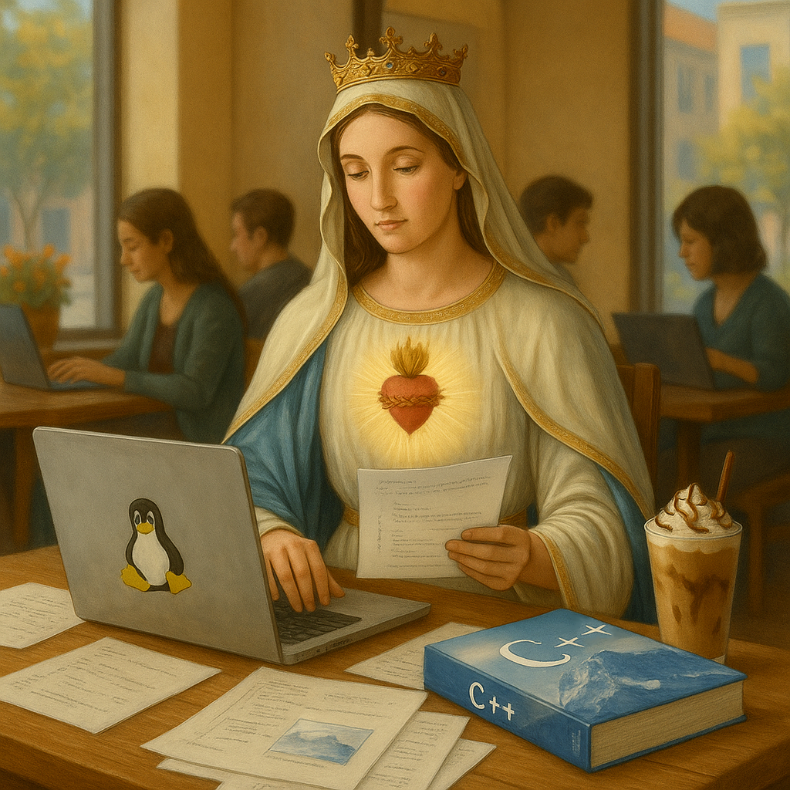
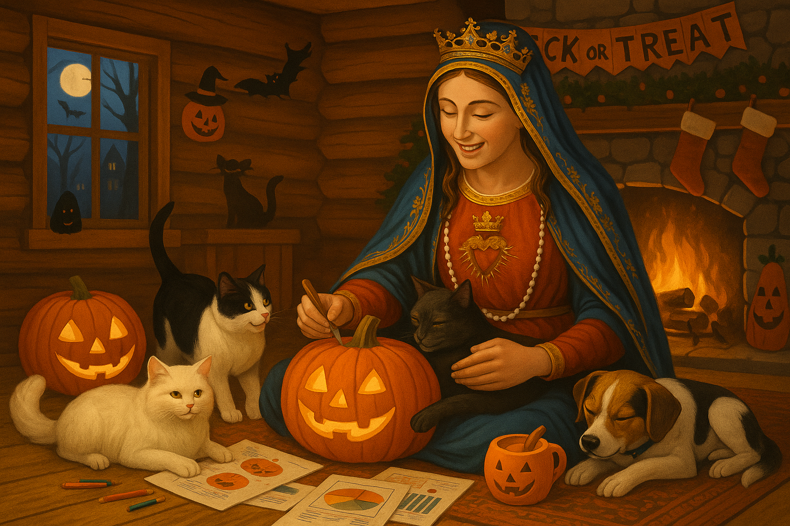
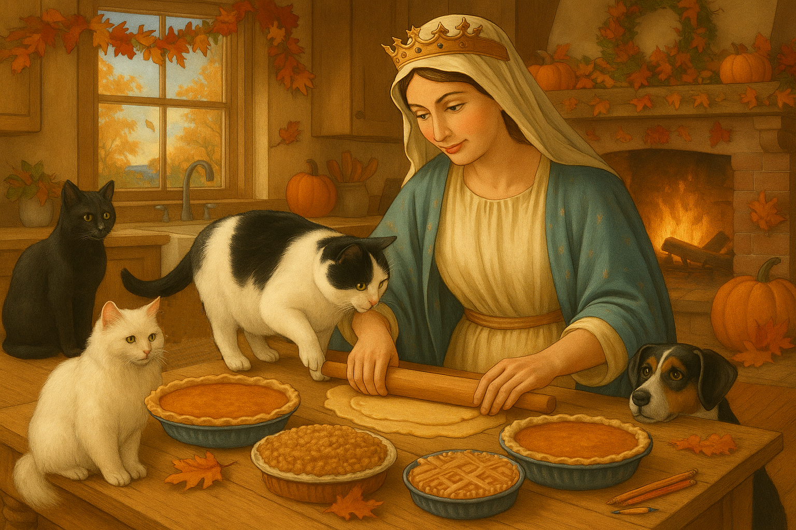

<link rel="stylesheet" href="{{ '/assets/css/style.css' | relative_url }}">

# 🏛️ Digital Marian Gallery

A curated collection of contemporary digital works depicting the **Blessed Virgin Mary**, programmer and data analyst of uncommon grace.  

Each room explores a different rhythm of her day — lab light, café hum, and evening calm.

---

    

      
🗺️ Gallery Map

      
Current Exhibition · Digital Marian Collection

      <ul class="map-sign__list">
        <li>➡️ <strong>In the Data Lab</strong></li>
        <li>↪️ <strong>At the Café</strong></li>
        <li>🏁 <strong>Mary at Home</strong></li>
      </ul>

      <ul class="map-sign__amenities">
        <li>🛍️ <strong>Gift Shop</strong> — fine prints, dashboards, and datasets</li>
        <li>🗂️ <strong>Archives & Research Room</strong></li>
        <li>ℹ️ <strong>Information Desk</strong></li>
      </ul>

      

      
<em>Audio Guide available soon.</em> 🎧

      
      
    

<h2 class="map-heading">🧪 In the Data Lab</h2>

<em>Gallery Wing I · Est. MMXXV</em>

— Gallery View —

  <a href="images/datawiz.png">
    

      
    

  </a>

  
  
  
  
  
   

  <em>
    Mary reviews the morning metrics, coffee in hand, her dashboards alive with new insight.
    Another quiet victory for clarity before the day begins.
  </em>

— End of the « <em>In the Data Lab</em> » Wing —

<h2 class="map-heading">☕ At the Café</h2>

<em>Gallery Wing II · Est. MMXXV</em>

— Gallery View —

  <a href="images/data-report-at-coffee-shop-autumn.png">
     
  </a>

  
  
  
  
  
   

  <em>
    Autumn in the café: the Blessed Mother reviews her latest reports over a well-earned pumpkin spice latte. Data cleansed, caffeine acquired, insights incoming.
  </em>

— Gallery View —

<a href="images/data-report-at-winter-coffee-shop.png">
     
</a>

  
  
  
  
  
   

  <em>
    Winter evening by the fire: Mary, Undoer of Knots, wrestles with a tangled data report that refuses to balance. A furrowed brow now — but the fix is already forming, quiet and sure as the snow outside.
  </em>

— Gallery View —

  <a href="images/springtime-coffeeshot.png">
     
  </a>

  
  
  
  
  
   

<em>
    Spring in the café: Our Lady’s Immaculate Heart glows as she codes a new library for experimental data visualization — merging Tufte’s precision with Du Bois’s imagination. A mocha frappe rests nearby, cooling as open-source creativity quietly takes shape.
  </em>

— End of the « <em>At the Café</em> » Wing —

<h2 class="map-heading">🏠 Mary at Home</h2>

<em>Gallery Wing III · Est. MMXXV</em>

— Gallery View —

  <a href="images/trick-or-treat.png">
     
  </a>

  
  
  
  
  
   

  <em>
    Halloween at home: Our Lady of the Rosary sets her data work aside to carve jack-o’-lanterns by the fire. The cider’s hot, the pets are drowsy—except for one curious cat plotting an ambush on a pumpkin. She laughs as the cat prepares its attack, convinced it’s helping with the carving.
  </em>

— Gallery View —

  <a href="images/thanksgiving.png">
     
  </a>

  
  
  
  
  
   

  <em>
    Late autumn in the kitchen: Mary prepares pumpkin and apple pies while her little audience waits for crumbs of grace — and crust. One cat can’t resist inspecting her handiwork, and she smiles, knowing curiosity is part of every good creation.
  </em>

— End of the « <em>Mary at Home</em> » Wing —

### 🕰️ Visiting Hours
Monday – Saturday · 09:00 – 18:00  
Sunday · Closed for quiet reflection and gentle maintenance  

### ✉️ Curator’s Desk
For inquiries regarding the collection, drop us a note at the   
[**gallery’s correspondence desk**](https://github.com/Blake-Madden/digital-marian-gallery/issues)

### 📜 House Notes
The *Digital Marian Gallery* is a living exhibit of code, analysis, and art.  
Works on rotation; serenity subject to network latency.

---

### 🎟️ Support the Gallery

If you enjoyed your visit, you can support future exhibitions by leaving a ⭐ on the [**project repository**](https://github.com/Blake-Madden/digital-marian-gallery).  

Every star helps keep the lights on in the Data Lab and the espresso warm in the Café Wing.

© 2025 Digital Marian Gallery · All images born of code and care.